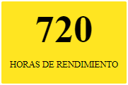

<p align="center">
  <a href="https://www.laboratoria.la/" rel="noopener" target="_blank"></a></p>
</p>

<h1 align="center">stylelab</h1>

Presentamos la guía de estilos, la cual te ayudará con el desarrollo de los diferentes productos digitales propios de la marca Laboratoria, dónde podrás realizar piezas de manera rápida con todos los elementos del branding actual.

<div align="">

## Soporte de Stylelab

Stylelab es un proyecto de Laboratoria open source. Es un proyecto desarrollado como parte del Bootcamp 2017-II, un trabajo colaborativo entre desarrolladoras Front-End y UX Designers.

## Tabla de contenido

* [Instalación](#instalación)

### Documentación

* [Uso de componente](#uso-de-componente)
* [Componente Button](#componente-button)
* [Componente Typography](#componente-typography)
* [Componente Card](#componente-card)

## Instalación

stylelab está disponible en [npm package](https://www.npmjs.com/package/stylelab).

```sh
npm install stylelab
```

## Uso de componente

```jsx
import React from "react";
import { Button } from "stylelab";

function App() {
  return (
    <Button yellow bold>
      Hello World
    </Button>
  );
}

render(<App />, document.querySelector("#app"));
```

#### Importando varios componentes

```jsx
import { Button, Typography, Card } from 'stylelab';

}
```

## Componente Button

Opciones: Se modifica el estilo del botón agregando los siguientes atributos:  
 `Colores de fondo:` yellow, green o pink.  
 `Tamaño:` big, medium o small.  
 `Color de Fuente:` white.  
 \*El color negro de la fuente ya esta predetermiando.  
 `Grosor de fuente:` bold.

**Ejemplo**


```jsx
import React from "react";
import { Button } from "stylelab";

function App() {
  return (
    <div>
      <Button yellow small>
        Laboratoria
      </Button>
      <Button pink medium bold>
        Laboratoria
      </Button>
      <Button green big white>
        Laboratoria
      </Button>
    </div>
  );
}

render(<App />, document.querySelector("#app"));
```

## Componente Typography

Demasiados estilos/tamaños de letras pueden arruinar cualquier diseño. Stylelab cuenta con una escala tipográfica, tiene un conjunto limitado de tamaños.

Opciones: Se modifica el estilo agregando los siguientes atributos:
**Atributos de tamaño**
`title1:` Título principal.  
 `title2:` Título secundario.  
 `title3:` Título terciario.  
 `phrase:` Usado en frases.
`body`
`body2`  
 **Atributo de colores**  
 `yellow, green o pink`  
 **Atributo para subrayado**  
 `under`  
 **Atributo grosor de fuente**  
 `bold`

**Ejemplo**


```jsx
import React from "react";
import { Typography } from "stylelab";

function App() {
  return (
    <div>
      <Typography title1 bold>
        Laboratoria LABORATORIA
      </Typography>

      <Typography title2 green>
        Laboratoria LABORATORIA
      </Typography>

      <Typography title3 pink>
        Laboratoria LABORATORIA
      </Typography>

      <Typography phrase yellow under>
        Laboratoria LABORATORIA
      </Typography>

      <Typography body bold green>
        Laboratoria LABORATORIA
      </Typography>

      <Typography body2 pink under>
        Laboratoria LABORATORIA
      </Typography>
    </div>
  );
}

render(<App />, document.querySelector("#app"));
```

## Componente Card

Opciones: Se modifica el estilo agregando los siguientes atributos:
**Atributos de tamaño**  
 `big`
`small`  
 **Atributo de fondo de color**  
 `yellow, green o pink`

**Ejemplo**




```jsx
import React from "react";
import { Card } from "stylelab";

function App() {
  return (
    <div>
      <Card pink big>
        <span>720</span>
        <p>HORAS DE RENDIMIENTO</p>
      </Card>
      <Card green small>
        <span>720</span>
        <p>HORAS DE RENDIMIENTO</p>
      </Card>
      <Card yellow big>
        <span>720</span>
        <p>HORAS DE RENDIMIENTO</p>
      </Card>
    </div>
  );
}

render(<App />, document.querySelector("#app"));
```

## Documentación

Revisa nuestra [documentación website]().

## Del Desarrollo

#### Research - Benchmarking

Nos basamos en la estructura de flujo de los frameworks reconocidos(Bootstrap, Materialize, Foundation, Pure )

#### Ideación - De la Definición

Se define los componentes principales para ésta primera versión de desarrollo:

* Botones
* Tipografías
* Tarjetas simples y con fotografías
* Encabezados

#### Prototipado - Del Flujo de Desarrollo

Se define de acuerdo al Benchmarking el flujo más óptimo para el desarrollo y visualización para el usuario.


#### Del Diseño

Como parte del reto se utiliza el manual del [branding actual]("assets/manual.pdf") para diseño, tipografía, logos, paleta de color y brackets.


#### User Flow alta fidelidad - Mobile


## Integrantes

* Alejandra Cabrera(Developer Front-End)
* Jymma Mogollón(Developer Front-End)
* Karina Buhezo(UX Designer)
* Mariela Cerna(UX Designer)

## Agradecimientos

Se agradece el soporte de Laboratoria y el reto de llevar a cabo éste producto con un entregable realizable y siguiendo los lineamientos de la marca.

## Licencia

Este proyecto se realiza bajo los términos y condiciones propias de [Laboratoria](http://www.laboratoria.la/).
